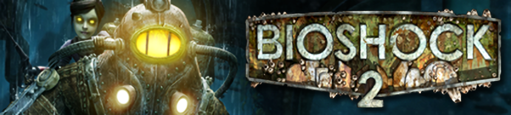

 

# BioShock 2 Multiplayer Sinclair Solutions Deluxe DLC

| Table of Context |
|------------------------------|
| 📜 [Intro](#intro)  
| 🗃️ [DLC 1 - Cut Content](#dlc-1---cut-content)  
| 📈 [DLC 2 - Rank Progression](#dlc-2---rank-progression)  
| 🔗 [Downloadable Content Links](#downloadable-content-links) 

## Intro

The Sinclair Solutions Deluxe DLC (SSD DLC) is a repository of unofficial DLC created for BioShock 2 Multiplayer to enhance gameplay with new content and experiences. The contents of this repository currently features restored cut content and additional ranks to unlock.

There are currently 2 DLCs available for Sinclair Solutions Deluxe.

## DLC 1 - Cut Content

### Details

1. **Features**
    - This DLC introduces 1 new Plasmid, 1 new Weapon, and 5 new Tonics! In addition to restoring cut content, DLC 1 also includes multiple fixes for Field-of-View, sensitivity adjustments, and a cosmetic issue affecting one of the loading screens. 
2. **Link** 
    - For more information about this DLC. Please click on the link below.
    - | [ 🔗 SSD DLC1 - Cut Content](SSDCutContentDLC.md)|
        |-|

### Preview

| Plasmid - Poison Quills | Weapon - Melee Weapon | Tonic - Adrenaline Eve | Tonic - Super Health | Tonic - Cold Punch | Tonic - Fire Punch | Tonic - Zap Punch |
|:-----------------------:|:---------------------:|:----------------------:|:--------------------:|:------------------:|:------------------:|:----------------:|
|  |  | | | | | |

## DLC 2 - Rank Progression

### Details

1. **Features**
    - This DLC introduces new ranks to Bioshock 2 Multiplayer. An additional 50 ranks have been added to the game increasing the rank cap from 50 to 100. This comes with 6 **BRAND** new icons, with rank 100 introducing the very first animated rank icon.
2. **Link**
    - For more information about this DLC. Please click on the link below.
    - |[ 🔗 SSD DLC2 - Rank Progression](SSDRankProgressionDLC.md)|
        |-|

### Preview

| Rank - Sapphire | Rank - Emerald | Rank - Amethyst | Rank - Dark Matter | Rank - ???? | Rank - ????|
|:---------------:|:--------------:|:---------------:|:------------------:|:-----------:|:----------:|
|  |  |  |  |  |  |

## Downloadable Content Links

|[SSD DLC1 - Cut Content](SSDCutContentDLC.md)|[SSD DLC2 - Rank Progression](SSDRankProgressionDLC.md)|
|--|--|