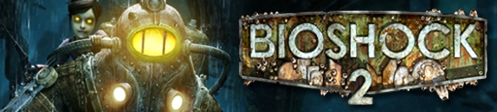
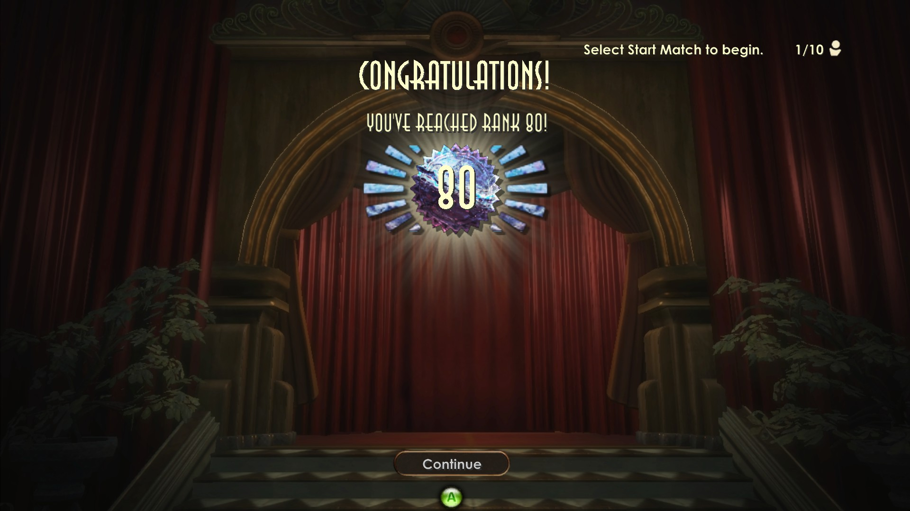

<br>

# Bioshock 2 Multiplayer Sinclair Solutions Deluxe DLC 2 - Rank Progression

| Table of Contents |
|------------------------------|
| 📜 [Intro](#intro)  
| 🏆 [Features](#features)  
| 💾 [DLC Installation](#dlc-installation)  
| ⚠️ [DLC Known Issues](#dlc-known-issues)  
| 📸 [Screenshots](#screenshots)  
| 🛠️ [Behind The Scenes](#behind-the-scenes) 

## Intro

This Sinclair Solutions Deluxe DLC is an unofficial DLC created for Bioshock 2 Multiplayer. Its purpose is to adjust the current rank cap and give players a new goal to pursue with their Adam.

## Features
1. **50 New Ranks**
    - The player rank cap has been increased from 50 to 100, allowing players to earn 50 additional ranks.
    - This means the total amount of Adam required to reach max rank has been adjusted based on a specific algorithm.
        - **Old**: 163,000
        - **New**: 1,015,500
    - The details of this algorithm will be explained below in [Behind The Scenes](#behind-the-scenes).
2. **6 New Rank Icons**
    - 6 brand new rank icons have been added, expanding the existing set of Bronze, Silver, Gold, Platinum and Diamond.

    - **Sapphire**
        - Ranks 51 - 59
    - **Emerald**
        - Ranks 60 - 69
    - **Amethyst**
        - Ranks 70 - 79
    - **Dark Matter**
        - Ranks 80 - 89
    - **???**
        - Ranks 90 - 99
    - **???**
        - Rank 100
    
    > **Note**: Wondering what Ranks 90 and 100 look like? Jump into a match and start earning Adam!

    | Sapphire | Emerald | Amethyst | Dark Matter | ??? | ??? |
    |:---------------------:|:---------------------:|:----------------------:|:-------------------------:|:-------------------:|:---------------:|
    |  |  |  |  |  |  |
3. **Fixes**
    - **Cricket Bat**
        - The Cricket Bat icon, which previously displayed the Rolling Pin icon, has been corrected and now properly displays the Cricket Bat icon.

        | Before | After |
        |:------:|:-----:|
        |  |  |
    - **Super Health**
        - The Super Health icon has been modified to have a less saturated icon which looks more consistent to Bioshock 2 Multiplayer's icon set.

        | Before | After |
        |:------:|:-----:|
        |  |  |

## DLC Installation
0. **Download**
    - Download the DLC from the release section of the Github. [Releases](TBA)
1. **Read the DLC Known Issues** section below before starting.
2. **Backup Files**
    - Backup `dlc2unlocks.ini` from `SteamLibrary\steamapps\common\BioShock 2\MP\Builds\Binaries` and  `SharedLibrary.swf` from `SteamLibrary\steamapps\common\BioShock 2\MP\Content\FlashMovies` by copying them to a new folder.
3. **Replace Files**
    - Drag and drop the new `dlc2unlocks.ini` and `SharedLibrary.swf` from the downloaded folder into their respective directories listed in step 2. When prompted, click **Replace** on any existing files. Make sure you are not replacing your backup files.
4. **Launch the Game**
5. **Verify "Next Rank In" Adam**
    - Go to a lobby and look at your Personal Statistics by clicking on **Statistics** then clicking on **Personal Statistics**.
    - If you are Rank 50, verify that the amount of Adam required for Rank 51 is 8500.
    - If you see a number here that is extremely large like 100K plus, please view the **DLC Known Issues** section below.
6. **Verify Icon Fixes**
    - Equip Oscar as your character and check his melee options. The **Cricket Bat** icon should now be the correct icon.
    - Go to loadouts and confirm if the **Super Health** tonic icon was correctly modified.
7. **Need Help?**
    - If you have any questions or concerns, please join the Bioshock 2 Multiplayer Official Discord for help installing.  
    - **[Bioshock 2 Multiplayer Discord Server](https://discord.gg/4ydTGHfFPQ)**
8. **Wanna Uninstall the DLC?**
    - To uninstall the DLC and revert to the vanilla version, simply replace the downloaded files with your backups.
    - If this doesn't work, you can verify the integrity of the game files within your Steam library.
    - If verifying still does not work, you will need to reinstall the game.

## DLC Known Issues
1. **Rank 51 Adam Requirements**
    - Some players may notice an extremely high Adam requirement for Rank 51. This occurs due to how the game stores the Adam count into 2 seperate counters.
        - Banked Adam - The player's total accumalated Adam.
        - Ranked Adam - The player's accumalated Adam for ranking up.
    - Ranked Adam only accumalates Adam while the player is actively ranking up. If the Rank Fix is applied, the player's Ranked Adam will only reflect the amount gathered up to the point when the fix was applied.
    - In the Rank Fix guide, in this case, the player only gathers 49 Rank Adam which is enough to reach Rank 50 immediately.
    - As a result, players who used the Rank Fix will unfortunately need 171,451 Adam to reach Rank 51 depending on when they applied the Rank Fix.
    - A fix for this is considered for a future update.
    - Until then, **Rank Fix** players should expect to earn 1,015,451 Adam for Rank 100 while normal players will only need around 852,500 Adam for Rank 100.
2. **I Was Above Rank 50 Before, and Now I'm Not—What Gives?**
    - As mentioned in Issue 1, if you use the Rank Fix to surpass Rank 50 you would only have 49+ Rank Adam stored onto your profile.
    - Normally, this would indicate that you would be reverted back to Rank 50 and would then experience the issue mentioned before.

## Screenshots

### New Rank Icon In-Game
<hr>


### New Rank Icon In Lobby
<hr>


<br>

### New Rank Icon In Personal Stats
<hr>


### New Rank Icon In Rank Rewards
<hr>



## Behind The Scenes
1. **Algorithm**
    - To create additional ranks, I decided to take a look at the algorithm **Digital Extremes** used to determine the Adam required for Ranks 1 - 50.
    - The algorithm is as follows:
    ```
        Initial Cases: 0 -> 1 = 0 Adam
        Initial Cases: 1 -> 2 = 500 Adam
        Adam Per Rank (A/R) = Previous(A/R) + ((Rank / 10) * 500)
        Adam Per Rank Cap (A/RC) = (A/R) * 2
    ```

### Examples
1. **Ranks 31 - 40**
     ```
     Ranks 21 - 29 have a Adam Per Rank value of 2500.
     Previous(A/R) = 2500
     A/R for Ranks 31 - 39: 
        (2500) + ((30 / 10) * 500) = 2500 + 1500 = 4000 (A/R)
     A/RC for Rank 40: 
        4000 (A/R) * 2 = 8000 (A/RC)
     ```
2. **Ranks 91 - 100**
    ```
    Ranks 91 - 100 have a Adam Per Rank value of 23500.
    Previous(A/R) = 19000
    A/R for Ranks 91 - 99: 
        (19000) + ((90 / 10) * 500) = 19000 + 4500 (A/R) = 23500 (A/R)
    A/RC for Rank 100: 
        23500 (A/R) * 2 = 47000 (A/RC)
    ```
